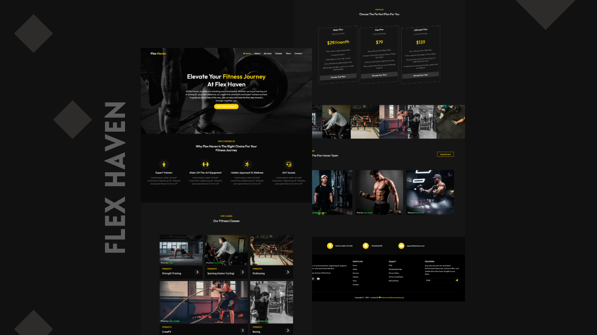

<div align="center">
  <br />
  <a href="https://flex-haven.vercel.app/" target="_blank">
    
  </a>
  
  <div>
    
    
    
  </div>

  <div align="center">
     <h3>💪 Flex Haven: Modern Gym & Fitness Website</h3>
    A responsive multi-page fitness website featuring <b>dynamic navigation, Swiper.js carousels, smooth UI interactions, contact form, and mobile-first design</b>.<br/>
    <i>Perfect for fitness enthusiasts, trainers, and gyms to showcase services and engage members.</i>
  </div>

  <br />

  <a href="https://flex-haven.vercel.app/" target="_blank">
    
  </a>
  <br />
</div>


---

## 📋 <a name="table">Table of Contents</a>

1. 🤖 [Introduction](#introduction)  
2. ⚙️ [Tech Stack](#tech-stack)  
3. 🔋 [Features](#features)  
4. 🤸 [Quick Start](#quick-start)  
5. 🔗 [Contacts](#contacts)  

---

### <a name="introduction">🤖 Introduction</a>

**Flex Haven** is a modern, responsive **gym & fitness website** built using **HTML, CSS, and JavaScript**.  
It’s designed to provide a professional online presence for gyms, featuring dynamic navigation, engaging sections, and a smooth user experience.  

This project demonstrates clean UI, responsive layouts, and interactive elements for fitness-focused businesses.

---

### <a name="tech-stack">⚙️ Tech Stack</a>

- **[HTML5](https://developer.mozilla.org/en-US/docs/Web/HTML)** for semantic structure and accessible content.  
- **[CSS3](https://developer.mozilla.org/en-US/docs/Web/CSS)** for responsive layouts, modern styling, and grid/flexbox design.  
- **[JavaScript](https://developer.mozilla.org/en-US/docs/Web/JavaScript)** for interactivity such as navigation toggle, active link highlighting, and form handling.  
- **[Swiper.js](https://swiperjs.com/)** for responsive, touch-friendly carousels used in the Team and Classes sections.  

---

### <a name="features">🔋 Features</a>

- **Responsive Navbar** with mobile-friendly hamburger menu  
- **Active Link Highlighting** to indicate the current page  
- **Engaging Hero Sections** with fitness-focused messaging  
- **Swiper.js Carousels** for team members and classes  
- **Contact Page with Google Maps** integration  
- **Interactive Contact Form** with submission feedback  
- **Footer with Newsletter Signup & Social Media Links**  
- **Cross-browser Compatible & Mobile First** design  

---

### <a name="quick-start">🤸 Quick Start</a>

Follow these steps to set up the project locally on your machine.

**Prerequisites**

Make sure you have the following installed:

- [Git](https://git-scm.com/)  
- Any modern web browser (Chrome, Firefox, Edge, etc.)

**Cloning the Repository**

```bash
git clone https://github.com/Itssanthoshhere/Flex-Haven.git
cd flex-haven
````

**Running the Project**

Simply open the `index.html` file in your browser, or use a live server extension in VS Code:

```bash
# if using VS Code
Right click index.html → "Open with Live Server"
```

---

### <a name="contacts">🔗 Contacts</a>

Feel free to connect with me:

* GitHub: [Itssanthoshhere](https://github.com/Itssanthoshhere)
* LinkedIn: [Santhosh VS](https://www.linkedin.com/in/thesanthoshvs/)

---

#### ⭐️ Show Your Support

If you liked this project, **give it a ⭐** and share it with others!

---

